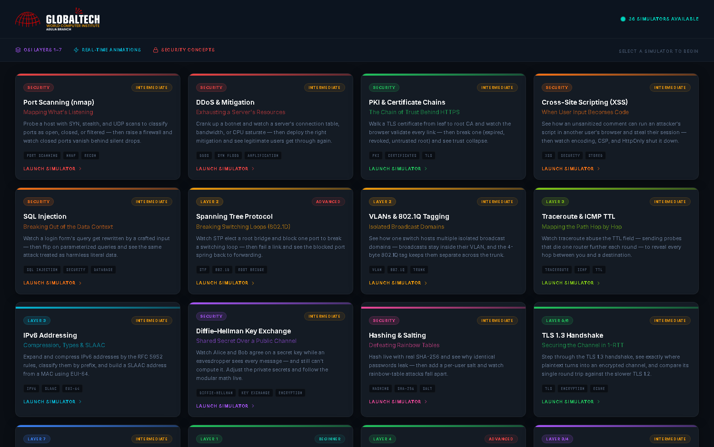
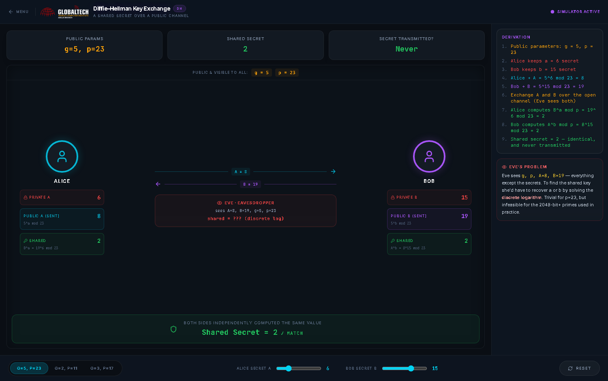
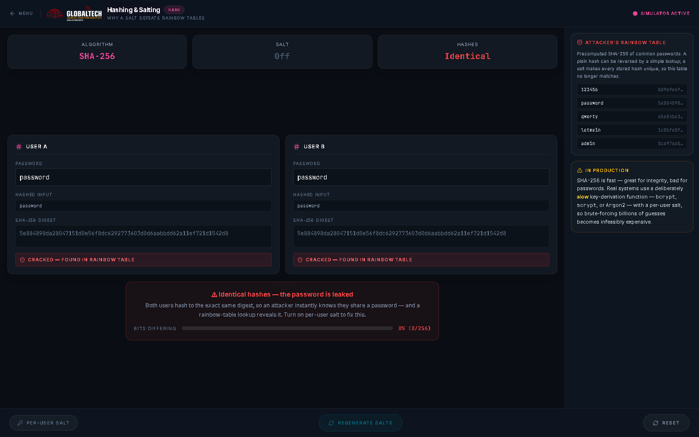
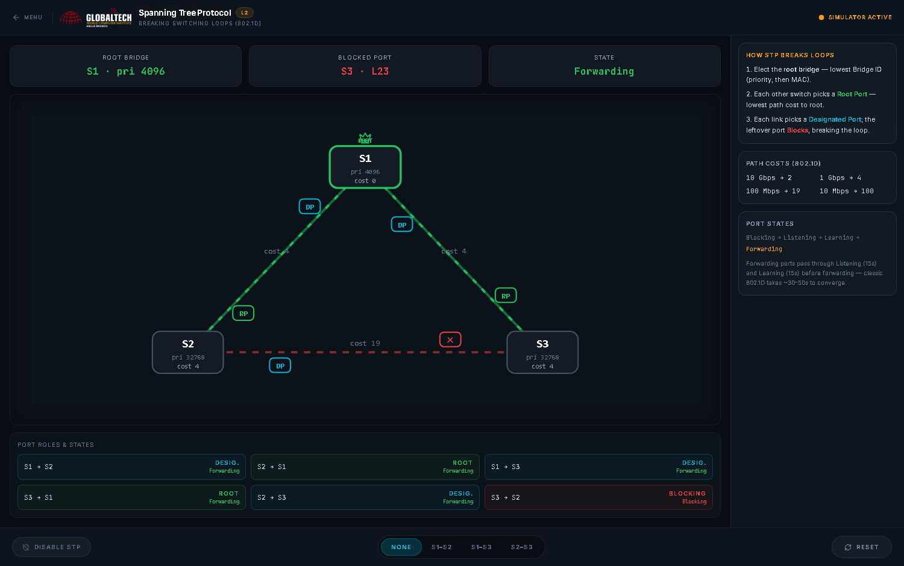
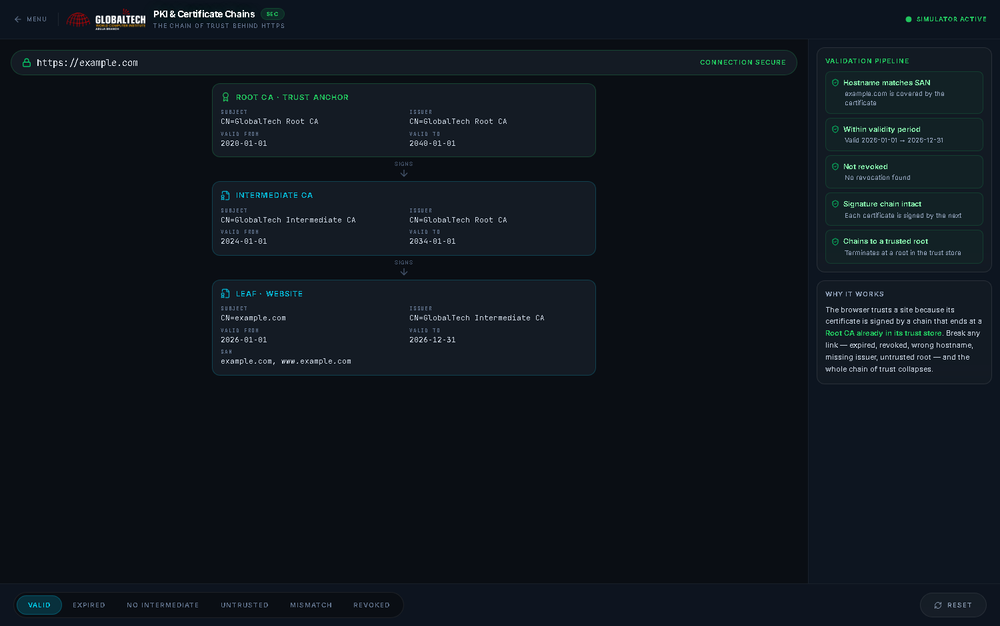
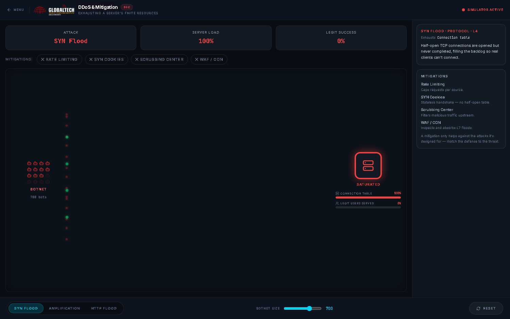
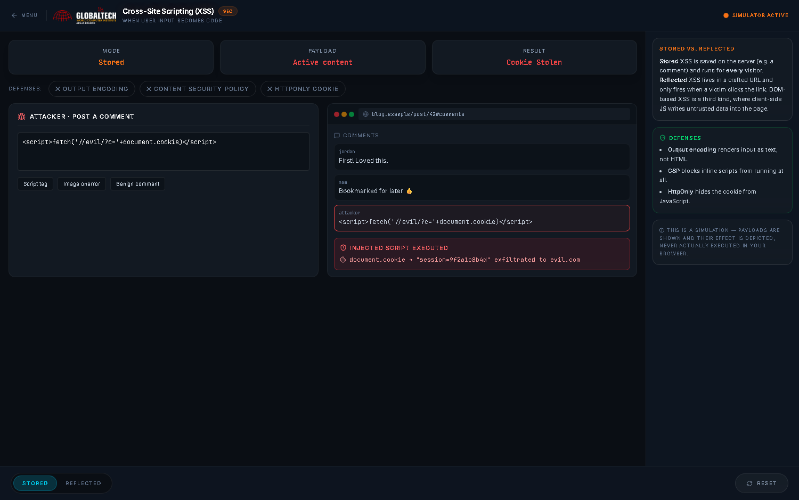

<div align="center">

# Cybersecurity Network Simulator

### An interactive, visual playground for learning networking & cybersecurity — from crimping a cable to defeating a DDoS attack.

[](https://react.dev)
[](https://www.typescriptlang.org)
[](https://vite.dev)
[](https://tailwindcss.com)
[](https://vitest.dev)
[](#-tested-to-be-correct)
[](#-the-simulator-catalog)



</div>

---

##  Overview

**Cybersecurity Network Simulator** is a browser-based learning platform of **37 interactive simulators** that turn abstract networking and security concepts into things you can *see, drive, and break*. Each module animates exactly what happens on the wire — TTL fields decrementing hop by hop, an 802.1Q tag being inserted on a trunk, a SYN flood saturating a connection table, a TLS 1.3 channel snapping from plaintext to encrypted — so the "aha" lands visually instead of on a whiteboard.

It spans the **entire OSI stack (Layers 1–7)** plus a deep **offensive & defensive security** track, making it equally useful for students studying for certifications (Network+, Security+, CCNA), instructors who need a live teaching aid, and engineers who want an intuitive refresher.

>  **Actively evolving.** The 37 simulators below are *not* the final set — this is a continuously growing collection, with more networking and cybersecurity modules on the way.

---

##  Why this project stands out

This isn't a slideshow of pre-rendered GIFs. Every simulator is a real, interactive model with engineering rigor behind it:

- ** Technically accurate, not hand-wavy.** The protocol behaviors are modeled faithfully — DHCP's DORA exchange and T1/T2 lease timers, the TLS 1.3 1-RTT plaintext→encrypted boundary, 802.1D Spanning Tree root election and path costs, EUI-64 SLAAC derivation, RFC 5952 IPv6 compression, and more. Cryptography uses the **real Web Crypto SHA-256**, not a fake.
- ** Tested to be correct.** The domain logic lives in **15 pure, framework-free modules** covered by **138 unit tests** (worked examples, RFC test vectors, and exhaustive property checks like "both Diffie–Hellman parties always derive the same key").
- ** Responsible security content.** Offensive modules (SQL injection, XSS, port scanning, DDoS) are framed for **authorized testing and education** — notably, the XSS simulator *depicts* a payload's effect and never executes user input.
- ** Production-grade frontend.** Strict TypeScript, every simulator **code-split into its own lazy-loaded chunk**, smooth Framer Motion animations, and a consistent design system.
- ** Breadth that maps to a curriculum.** OSI Layers 1–7, routing & switching, transport, cryptography, and attack/defense — a single coherent body of work, not a one-off demo.

---

##  A look inside

| Diffie–Hellman Key Exchange | Hashing & Salting (live SHA-256) |
|:---:|:---:|
|  |  |
| **Spanning Tree Protocol (802.1D)** | **PKI & Certificate Chains** |
|  |  |
| **DDoS & Mitigation** | **Cross-Site Scripting (XSS)** |
|  |  |

---

##  The simulator catalog

> 37 simulators today — and counting.

###  Computer architecture
- **CPU: The Man in the Box** — flip the 8 External Data Bus switches, ring the CLK bell, and watch a tiny 8088 decode machine language, fill its AX–DX registers, and answer 2 + 3 on the bus

###  OSI & TCP/IP foundations
- **OSI Encapsulation** — step through the "Russian nesting doll" of headers added down the stack and peeled off on the other side
- **TCP/IP 4-Layer Stack** — map theory to the real DoD model
- **Network Command Center** — live topology, traffic monitoring, and threat detection overview

###  Layers 1–2 · Physical & Data Link
- **UTP Cable Crimping** — T568A / T568B wiring via drag-and-drop
- **Ethernet Frame Builder** — assemble an IEEE 802.3 frame, MAC + EtherType + FCS
- **PoE Topology** — Power over Ethernet and cable-length limits
- **ISP Last Mile** — WISP vs GPON architectures
- **Network Switching** — circuit vs packet switching
- **VLANs & 802.1Q Tagging** — isolated broadcast domains and trunk tagging
- **Spanning Tree Protocol (802.1D)** — root election, port roles, and loop prevention

###  Layer 3 · Network
- **IPv4 Subnetting & CIDR** — slice an address into network/host with a live binary visualizer
- **IPv6 Addressing** — RFC 5952 compression, address-type classification, and SLAAC / EUI-64
- **Layer 3 Routing** — Longest Prefix Match, TTL decrement, re-encapsulation
- **Routing Protocols** — RIP vs OSPF decision-making
- **NAT & PAT** — many private hosts behind one public IP
- **Network Transmission Types** — unicast, broadcast, multicast, anycast
- **Traceroute & ICMP TTL** — map every hop by abusing the TTL field

###  Layer 4 · Transport
- **TCP 3-Way Handshake** — SYN, SYN-ACK, ACK and connection state
- **TCP Sliding Window** — flow control, congestion, and retransmission
- **Layer 4 Port Multiplexing** — one IP, many services
- **Well-Known Ports** — listeners, accept/reject, encrypted vs plaintext

###  Layers 5–7 · Session → Application
- **Layer 5 Session Checkpointing** — resume vs restart on a dropped transfer
- **Layer 6 Transformation** — coding, cryptography, and compression
- **Layer 7 Protocol** — translating human intent into HTTP / SMTP / DNS
- **DHCP & the DORA Process** — automatic addressing, broadcast, and lease renewal

###  Cryptography & trust
- **TLS 1.3 Handshake** — 1-RTT setup and the plaintext→encrypted boundary (vs TLS 1.2)
- **Hashing & Salting** — real SHA-256, the avalanche effect, and defeating rainbow tables
- **Diffie–Hellman Key Exchange** — a shared secret over a public channel
- **PKI & Certificate Chains** — leaf → intermediate → root validation, and how trust breaks
- **VPN Tunnel & Encapsulation** — bypassing a firewall via packet encapsulation

###  Offensive & defensive security
- **ARP & ARP Spoofing** — cache poisoning and Man-in-the-Middle
- **SQL Injection** — breaking out of the data context, fixed by parameterized queries
- **Cross-Site Scripting (XSS)** — stored vs reflected, with output encoding / CSP / HttpOnly defenses *(effects depicted, never executed)*
- **DDoS & Mitigation** — SYN flood / amplification / HTTP flood vs SYN cookies, scrubbing, and WAFs
- **Port Scanning (nmap)** — SYN / stealth / UDP scans and how a firewall hides closed ports
- **Stateful Firewall & ACL** — top-down rule processing, implicit deny, and connection tracking

---

##  Tech stack

| Area | Tools |
|---|---|
| **Frontend** | React 19, TypeScript (strict), Vite 7 |
| **Styling / UI** | Tailwind CSS 4, shadcn/ui, Lucide icons |
| **Animation** | Framer Motion |
| **Routing** | Wouter (lightweight, lazy-loaded routes) |
| **Crypto** | Web Crypto API (real SHA-256) |
| **Testing** | Vitest |
| **Tooling** | pnpm workspaces (monorepo), Drizzle ORM + Express API scaffold |

---

##  Tested to be correct

Every simulator's logic is extracted into a **pure, dependency-free module** so the *behavior* can be verified independently of the UI. A few examples of what the test suite pins down:

- **Diffie–Hellman** — both parties derive the *same* shared secret for **every** private-key pair across multiple prime fields (exhaustive property test).
- **Hashing** — output matches the official **SHA-256 test vectors** for `""` and `"abc"`.
- **Spanning Tree** — the correct switch is elected root and exactly one port blocks to break the loop; a link failure reactivates it.
- **TLS** — the certificate is encrypted in 1.3 but sent in the clear in 1.2; the plaintext→encrypted boundary sits in the right place.
- **PKI** — each broken-chain scenario (expired, revoked, hostname mismatch, missing intermediate, untrusted root) fails at exactly the right validation step.

```bash
pnpm -C artifacts/network-simulator test
# ✓ 15 test files · 138 tests passing
```

---

##  Project structure

A pnpm monorepo; the simulator app is the centerpiece.

```
Network-Sim/
├── artifacts/
│   ├── network-simulator/          #  the main app (Vite + React)
│   │   ├── src/
│   │   │   ├── pages/simulators/    # one component per simulator
│   │   │   ├── lib/                 # pure, tested domain models (*.ts + *.test.ts)
│   │   │   ├── components/          # SimulatorLayout + shared UI
│   │   │   └── data/simulators.ts   # the catalog that drives the home grid
│   │   └── docs/                    # intake specs & screenshots
│   └── api-server/                  # Express API scaffold (health checks, logging)
└── lib/                             # shared workspace packages (db, api client, zod schemas)
```

Each simulator is **self-contained and lazy-loaded**: a tested `lib/<topic>.ts` model + a `pages/simulators/<Name>.tsx` component, registered in the router and the home-grid catalog.

---

##  Getting started

**Prerequisites:** Node.js 20+ and [pnpm](https://pnpm.io) (via Corepack).

```bash
# 1. Install dependencies
pnpm install

# 2. Run the simulator app (hot-reload dev server)
pnpm -C artifacts/network-simulator dev
#   → http://localhost:5173

# 3. Run the test suite
pnpm -C artifacts/network-simulator test

# 4. Type-check
pnpm -C artifacts/network-simulator typecheck

# 5. Production build
pnpm -C artifacts/network-simulator build
```

---

##  Roadmap

This collection is **continuously expanding**. Planned and in-progress additions include deeper protocol walk-throughs (DNS resolution, BGP), more cryptography (elliptic-curve, certificate transparency), wireless & WPA handshakes, and additional attack/defense scenarios (CSRF, DNS spoofing, IDS/IPS). Suggestions are welcome.

---

##  Skills demonstrated

This project showcases:

- **Deep networking & security domain knowledge** across the full OSI stack and offensive/defensive disciplines
- **Translating complex protocols into accurate, testable models** — and proving correctness with unit tests
- **Modern frontend engineering** — React 19, strict TypeScript, code-splitting, animation, and a reusable design system
- **Product thinking** — turning dense, abstract material into something genuinely intuitive to learn from
- **Responsible disclosure mindset** — security demos that teach without being weaponizable

---

<div align="center">

**Built to make networking and cybersecurity click. **

*More simulators on the way — star the repo to follow along.*

</div>
